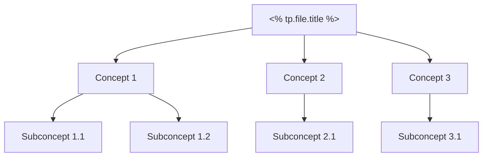

# 🗺️ Map of Content: <% tp.file.title %>

## 📖 Chapter Overview

### Learning Objectives
- 

### Key Topics Covered
- 

### Prerequisites
- [[Previous Chapter MOC]]

### Next Steps
- [[Next Chapter MOC]]

## 📚 Topic Structure

### Core Concepts

### Atomic Notes Index
#### Foundation Concepts
- [[Concept Name 1]]
- [[Concept Name 2]]
- [[Concept Name 3]]

#### Formulas and Theorems
- [[Formula Name 1]]
- [[Theorem Name 1]]
- [[Formula Name 2]]

#### Examples and Applications
- [[Example: Problem Type 1]]
- [[Example: Problem Type 2]]
- [[Application: Real World 1]]

#### Practice Problems
- [[Practice: Basic Problems]]
- [[Practice: Advanced Problems]]
- [[Practice: Challenge Problems]]

## 🎯 Learning Path

### Sequential Learning Order
1. [[Concept Name 1]] → [[Concept Name 2]] → [[Concept Name 3]]
2. [[Formula Name 1]] → [[Example: Problem Type 1]]
3. [[Practice: Basic Problems]] → [[Practice: Advanced Problems]]

### Alternative Learning Paths
- **Application-focused:** [[Concept Name 1]] → [[Example: Problem Type 1]] → [[Formula Name 1]]
- **Theory-focused:** [[Concept Name 1]] → [[Formula Name 1]] → [[Theorem Name 1]]

## 📊 Progress Tracking

### Concept Mastery
- [ ] [[Concept Name 1]] - Mastered
- [ ] [[Concept Name 2]] - In Progress
- [ ] [[Concept Name 3]] - Not Started

### Practice Completion
- [ ] Basic Problems: 0/10
- [ ] Advanced Problems: 0/5
- [ ] Challenge Problems: 0/3

## 🔗 External Connections

### Cross-Chapter Links
- [[Related Chapter MOC 1]] - Connection description
- [[Related Chapter MOC 2]] - Connection description

### Real-World Applications
- 

## 📝 Notes

### Key Insights
- 

### Difficult Topics
- 

### Review Schedule
- **First Review:** <% tp.date.now("YYYY-MM-DD", 7) %>
- **Second Review:** <% tp.date.now("YYYY-MM-DD", 21) %>
- **Final Review:** <% tp.date.now("YYYY-MM-DD", 45) %>

---

**Created:** <% tp.date.now("YYYY-MM-DD HH:mm") %>  
**Last Updated:** <% tp.date.now("YYYY-MM-DD HH:mm") %>  
**Total Atomic Notes:**  
**Completion Rate:**  

---
## 📋 Quick Navigation
- [[Zhang Yu 30 Lectures - Main MOC]]
- [[Course Overview]]
- [[Study Plan]]