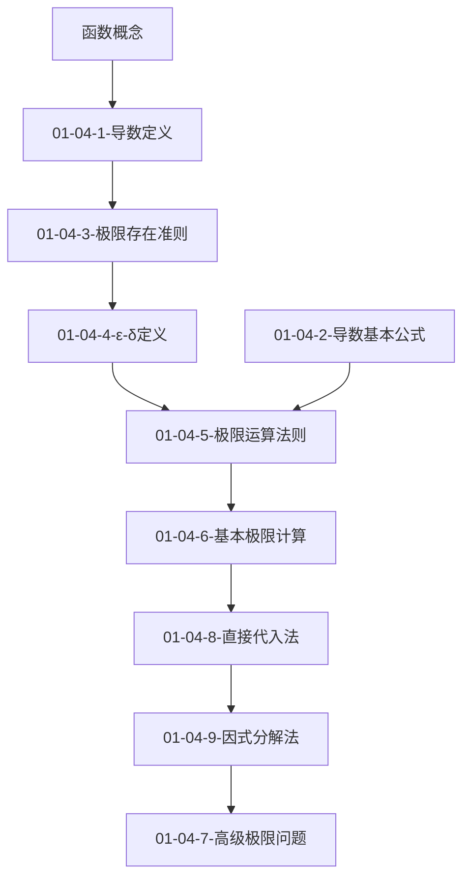

# 🗺️ 01-04-函数极限与性质 - MOC

## 📋 讲次概览

### 讲次信息
- **章节**: 第1讲 - 函数极限与连续性
- **讲次**: 第4讲 - 函数极限概念与性质
- **难度**: 🟡 中级
- **预计学习时间**: 2-3小时
- **复习周期**: 1天、1周、1个月

### 核心目标
- 理解函数极限的严格定义
- 掌握极限的性质和运算法则
- 学会基本的极限计算方法
- 建立极限与连续性的联系

---

## 🔗 知识网络

### 原子笔记连接
```dataview
TABLE WITHOUT ID
  file.link as "📝 原子笔记",
  topic as "📚 主题",
  difficulty as "🎯 难度",
  mastery_level as "📊 掌握程度",
  date as "📅 学习日期"
FROM "02_原子笔记"
WHERE 
  note_id = "01-04-*" OR
  (chapter = "01" AND lecture = "04")
SORT note_id ASC
```

### 学习进度追踪
```dataview
TABLE WITHOUT ID
  choice(difficulty, "未分类") as "🎯 难度",
  length(filter(rows.file.link, mastery_level = "完全掌握")) as "🟢 完全掌握",
  length(filter(rows.file.link, mastery_level = "基本理解")) as "🟡 基本理解",
  length(filter(rows.file.link, mastery_level = "初学")) as "🔴 初学",
  length(rows.file.link) as "📊 总计"
FROM "02_原子笔记"
WHERE 
  note_id = "01-04-*" OR
  (chapter = "01" AND lecture = "04")
GROUP BY difficulty
```

### 知识点层次结构
```
01-04-函数极限与性质
├── 📊 核心概念
│   ├── 01-04-1-导数定义
│   ├── 01-04-3-极限存在准则
│   └── 01-04-4-ε-δ定义
├── 📐 理论基础
│   ├── 01-04-5-极限运算法则
│   └── 01-04-2-导数基本公式
└── 🛠️ 计算方法
    ├── 01-04-6-基本极限计算
    ├── 01-04-8-直接代入法
    ├── 01-04-9-因式分解法
    └── 01-04-7-高级极限问题
```

---

## 🎯 学习路径

### 推荐学习顺序
1. **🔄 前置知识**: [[函数概念]]、[[数列极限]]
2. **📊 核心概念**: 
   - [[01-04-1-导数定义]] → [[01-04-3-极限存在准则]] → [[01-04-4-ε-δ定义]]
3. **📐 理论基础**: 
   - [[01-04-5-极限运算法则]] ← [[01-04-2-导数基本公式]]
4. **🛠️ 计算方法**: 
   - [[01-04-6-基本极限计算]] → [[01-04-8-直接代入法]] → [[01-04-9-因式分解法]] → [[01-04-7-高级极限问题]]

### 知识依赖关系


---

## 📊 Canvas知识图谱

### 可视化连接
- **主图谱**: [[Canvas_01_04_函数极限与性质]]
- **概念关系**: 查看01-04-Function_Limits_and_Properties.canvas
- **交互式学习**: 在Canvas中拖拽节点建立连接

### Canvas使用方法
1. **中心节点**: 函数极限与性质
2. **概念群组**: 核心概念、理论基础、计算方法
3. **连接线**: 表示依赖关系和应用关系
4. **颜色编码**: 按难度和类型区分

---

## 🔄 双向连接系统

### 前置知识
- [[函数概念]] - 理解函数的基本概念
- [[数列极限]] - 极限的离散版本
- [[连续性]] - 极限的重要应用

### 后续应用
- [[函数连续性]] - 基于极限的连续性定义
- [[导数计算]] - 极限在导数中的应用
- [[积分概念]] - 极限在积分中的应用

### 相关概念
- [[无穷小量]] - 极限理论的重要概念
- [[无穷大量]] - 极限的另一种形式
- [[渐近线]] - 函数行为的几何表现

---

## 📚 学习资源

### 学习时间分析
```dataview
TABLE WITHOUT ID
  "学习时间统计" as "📊 统计项目",
  sum(choice(study_time, 0)) as "⏱️ 总时间(分钟)",
  round(sum(choice(study_time, 0)) / 60, 1) as "⏰ 总时间(小时)"
FROM "02_原子笔记"
WHERE 
  note_id = "01-04-*" OR
  (chapter = "01" AND lecture = "04")
```

### 复习频率分析
```dataview
TABLE WITHOUT ID
  file.link as "📝 笔记",
  topic as "📚 主题",
  choice(review_count, 0) as "🔄 复习次数",
  date as "📅 最后学习"
FROM "02_原子笔记"
WHERE 
  note_id = "01-04-*" OR
  (chapter = "01" AND lecture = "04")
SORT review_count DESC
```

### 练习资源
- [[极限练习题集]] - 基础练习
- [[极限证明题集]] - 理论证明
- [[极限应用题集]] - 实际应用

---

## 🎯 学习目标检查

### 基础目标
- [ ] 理解极限的直观概念
- [ ] 掌握极限的严格定义
- [ ] 学会基本的极限计算

### 进阶目标
- [ ] 理解极限的性质和定理
- [ ] 掌握复杂的极限计算技巧
- [ ] 能够证明基本的极限性质

### 高级目标
- [ ] 解决复杂的极限问题
- [ ] 建立知识间的连接
- [ ] 应对考研难度题目

---

## 📝 学习记录

### 相关学习日志
```dataview
TABLE WITHOUT ID
  file.link as "学习记录",
  date as "日期"
FROM "05_学习日记"
WHERE 
  contains(file.content, "01-04") OR
  contains(file.content, "函数极限")
SORT date DESC
LIMIT 5
```

### 复习计划
- **第1次复习**: 学习后1天
- **第2次复习**: 学习后1周
- **第3次复习**: 学习后1个月
- **第4次复习**: 考前2周

---

## 💡 学习建议

### 有效学习方法
1. **概念先行**: 先理解直观概念，再学习严格定义
2. **图形辅助**: 结合图形理解极限的几何意义
3. **练习巩固**: 通过大量练习掌握计算技巧
4. **联系实际**: 将极限与物理、几何应用结合

### 常见错误
- 混淆极限存在与函数值存在
- 忽视极限定义的严格条件
- 计算过程中的代数错误

### 学习技巧
- 使用[[Canvas_01_04_函数极限与性质]]可视化知识连接
- 定期回顾[[01-04-1-导数定义]]等核心概念
- 通过[[复习追踪系统]]管理复习计划

---

## 📊 进度追踪

### 学习进度
- [x] 核心概念学习
- [x] 理论基础掌握
- [x] 计算方法练习
- [ ] 综合应用训练
- [ ] 考试模拟练习

### 掌握程度自评
- **概念理解**: 🟢 90%
- **计算能力**: 🟡 75%
- **证明能力**: 🟡 70%
- **应用能力**: 🔴 60%

---

*创建时间: {{date:YYYY-MM-DD HH:mm}}*
*最后更新: {{date:YYYY-MM-DD HH:mm}}*
*下次复习: {{date:YYYY-MM-DD, 7}}*

---

## 🔗 相关链接

- **主索引**: [[张宇30讲-主索引]]
- **章节MOC**: [[01-函数极限与连续性-MOC]]
- **Canvas**: [[Canvas_01_04_函数极限与性质]]
- **学习记录**: [[05_学习日记]]
- **复习系统**: [[复习追踪系统]]