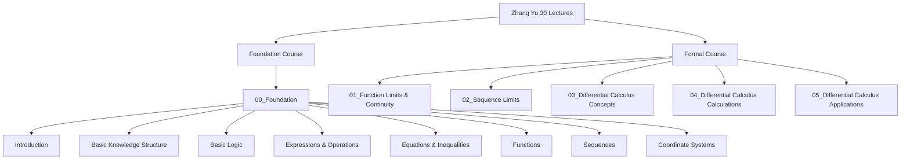

# 🗺️ Zhang Yu 30 Lectures - Main Map of Content

## 📚 Course Overview

### Course Structure

### Learning Path
1. **Foundation (00)**: Basic concepts and preparation
2. **Core Content (01-05)**: Main course material following Zhang Yu's progression

## 📖 Module MOCs

### Foundation Module
- *00_Foundation模块待创建*

### Core Modules
- [[01-函数极限与连续性-MOC]] - 函数极限与连续
- [[02-数列极限-MOC]] - 数列极限
- [[03-一元函数微分学概念-MOC]] - 一元函数微分学概念
- [[04-一元函数微分学计算-MOC]] - 一元函数微分学计算
- [[05-一元函数微分学应用-MOC]] - 一元函数微分学应用

## 🎯 Study Strategy

### Recommended Approach
1. **Complete foundation first**: Master all 00_Foundation topics
2. **Follow lecture order**: Progress through 01-05 sequentially
3. **Atomic learning**: Create focused notes for each concept
4. **Regular review**: Use spaced repetition for key concepts

### Time Allocation
- **Foundation**: ~2 weeks
- **Each core module**: ~1-2 weeks
- **Review and practice**: ~30% of study time

## 📊 Progress Tracking

### Overall Progress
- [ ] **Foundation Module**: 0/8 complete
- [ ] **Module 01**: 0/7 complete
- [ ] **Module 02**: 0/2 complete
- [ ] **Module 03**: 0/2 complete
- [ ] **Module 04**: 0/2 complete
- [ ] **Module 05**: 0/2 complete

### Mastery Levels
- **Beginner**: Foundation topics
- **Intermediate**: Core concepts understanding
- **Advanced**: Problem-solving applications
- **Mastered**: Teaching others capability

## 🔗 Supporting Materials

### Review Resources
- *公式总结-MOC待创建* - 所有关键公式汇总
- *错误收集-MOC待创建* - 常见错误和解决方案
- *练习题集-MOC待创建* - 测试准备材料

### Study Planning
- *周计划待创建* - 本周目标
- *月计划待创建* - 月度目标和里程碑
- [[05_学习日记]] - 每日学习记录

## 💡 Learning Tips

### Effective Study Habits
- **Daily sessions**: 2-3 hours of focused study
- **Mix content**: Alternate between theory and practice
- **Active recall**: Test yourself regularly
- **Teach to learn**: Explain concepts to others

### Tools and Techniques
- **Obsidian Canvas**: Visualize connections between concepts
- **Spaced repetition**: Regular review of difficult topics
- **Problem sets**: Progressive difficulty practice
- **Peer discussion**: Join study groups when possible

## 📝 Course Metadata

**Total Lectures:** 30  
**Total Modules:** 6  
**Estimated Duration:** 12-16 weeks  
**Difficulty Level:** Intermediate to Advanced  
**Prerequisites:** High school mathematics

---

**Created:** 2024-09-06  
**Last Updated:** 2024-09-06  
**Next Review:** 2024-09-13

---
## 🚀 Quick Start
1. *查看00_Foundation模块*（待创建）了解前置知识
2. *设置学习计划*（待创建）安排时间
3. 在[[05_学习日记]]中创建第一条记录跟踪进度
4. 从[[01-函数极限与连续性-MOC]]开始学习